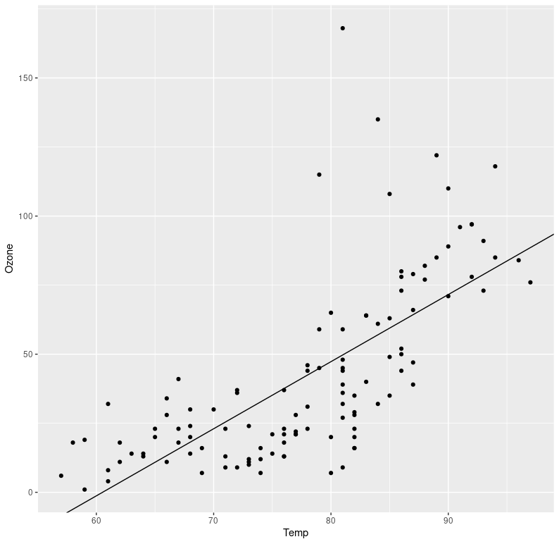

# targets-R-proj

# setup
```{r}
install.packages(c("visNetwork", "targets"))
```

# check for errors

```{r}
tar_manifest(fields = all_of("command"))
```

```         
# A tibble: 4 × 2
  name  command                    
  <chr> <chr>                      
1 file  "\"example-data/data.csv\""
2 data  "get_data(file)"           
3 model "fit_model(data)"          
4 plot  "plot_model(model, data)"  
```

# run the pipeline

```{r}
tar_make()
```

```
▶ dispatched target file
● completed target file [0.104 seconds]
▶ dispatched target data
New names:
• `` -> `...1`
● completed target data [0.113 seconds]
▶ dispatched target model
● completed target model [0.002 seconds]
▶ dispatched target plot
● completed target plot [0.008 seconds]
▶ ended pipeline [0.293 seconds]
```

# view the results

```{r}
tar_read(plot)
```



```{r}
tar_read(model)
```

```         
(Intercept)        Temp 
-146.995491    2.428703
```
